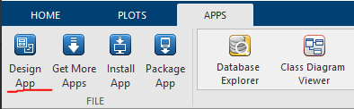

# Proyecto final Paradigmas de programación

Trabajo realizado por los alumnos:

Monserrat Sanchez Juarez

Samuel Alejandro Torrez Oropeza

## Detalles del proyecto

El proyecto requiere de implementar los principios de la programación orientada a objetos, orientada a eventos, funcional, cómputo científico y una conexión a base de datos en MySQL.

### Diagrama del proyecto

El proyecto tiene un flujo de información detallado en el siguiente diagrama.

Ahora vamos a detallar como interactuan los diferentes paradigmas de programación en el proyecto y su implementación.

### Programación orientada a objetos

Para implementar la programación orientada a objetos en el proyecto, se utiliza la clase bicho en MATLAB, en el archivo bicho.m se encuentra especificada esta clase en la que se almacenan las propiedades extraidas de la consulta a la base de datos. Como se mostró en el diagrama, la clase es utilizada por el script principal para poder definir una lista de objetos de tipo bicho que será cargada en la interfaz de usuario.

### Programación orientada a eventos

Para este módulo se uso la herramienta proveida por MATLAB llamada App Designer, disponible en la pestaña de Apps en el ícono de "Design App".

Aquí se diseñó el siguiente layout el cual servirá para interactuar con el usuario más tarde.

Para poder utilizar y editar esta interfaz gráfica, a los componentes que necesitemos, le agregamos funciones llamadas **_callbacks_**, las cuales podremos manejar según lo requerimos. Para este caso, tenemos callbacks para el evento de hacer clic en el botón de cargar información y para cuando se selecciona un nuevo valor en el dropdown. En cada una de estas funciones ejecutamos una llamada al script main para obtener la información de los objetos, obtenemos el que coincida con el nombre seleccionado (al cargar información, por default se selecciona el primero) y se muestra al usuario su información. A continuación se muestra un ejemplo:

Primero cuando la información no ha sido cargada.

Es importante destacar que cada campo salvo los que se ha dicho que tienen un callback, no son editables, por lo que solo sirven para mostrar la información.

Ahora se muestra el ejemplo con información cargada.

### Programación funcional

En este caso se utilizó del lenguaje de programación Python para crear funciones lambda que nos permitan generar un arreglo de puntos para graficar el crecimiento del organismo, esta integración es posible debido a que MATLAB nos permite correr scripts de python por medio del comando pyrunfile para correr estas funciones y recibir el arreglo en MATLAB.
El script que vamos a utilizar para esto se encuentra en la carpeta **python** y se llama scripts.py.

### Conexión a base de datos

La base de datos se encuentra alojada en AWS para tener disponibilidad todo el tiempo, se realiza por medio del data explorer en MATLAB. Es necesario instalar el addon de matlab llamado Database ToolBox, desde este encontraremos el ícono de Database Explorer en el apartado de apps.

Así mismo es pertinente instalar en nuestra computadora la versión más reciente del conector ODBC de mysql disponible en su página. Cumplidos estos requisitos podremos crear una conexión a la base de datos.

Seleccionando un data source, seleccionamos una fuente ODBC. Esto nos abre un nuevo menú como el siguiente, en el que debemos seleccionar la opción de agregar para crear una nueva conexión.

En este segundo menú seleccionamos una ODBC ANSI, esto nos abre un formulario como el siguiente en el que tenemos que crear nuestra conexión, llenamos con los datos que ingresamos en MySQL Workbench y podemos probar la conexión.

El Data Source Name es el nombre con el que después en el script de main podremos acceder a la conexión creada en nuestro cliente de MATLAB.

La base de datos sigue el siguiente diagrama Entidad-Relación

### Conexión a traves de main

Como se puede observar en el diagrama, es en main donde encontramos una conexión para unificar todos los paradigmas, desde este se crea una conexión utilizando el cliente de MATLAB desde el Data Source creado en el apartado anterior. Aquí es donde hacemos la llamada a la lambda en scripts.py y donde se almacena el arreglo de objetos de tipo bicho para el entorno gráfico.
